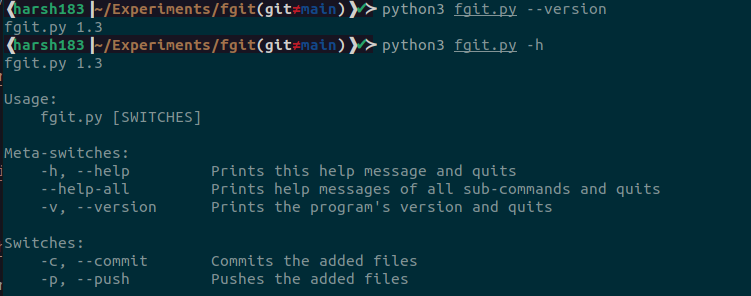
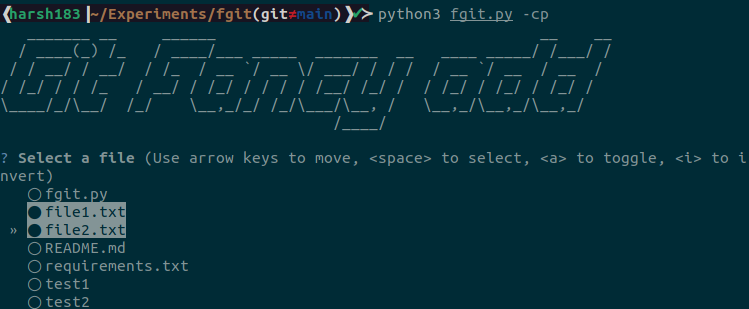
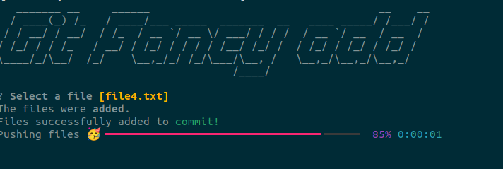

# fgit: Fancy Git Client 

Command-line git client with fancy interface features! See the code at `fgit.py`.







Expanded from a [tutorial workshop](https://125summer.tech/cli) I did in Summer 2021 as part of UIUC Summer of Side Projects for a talk at UIUC GNU/Linux Users Group.

Note that this is an example project to demonstrate the wide variety of command-line interface building libraries that python has available. Of course, an actual client will account for more edge cases and a more extensive feature set.

## Libraries demonstrated

Most of what's being done here with excellent Python libraries:

### questionary

[Questionary](https://questionary.readthedocs.io/en/stable/) does a great job at all sorts of command line question asking. Checkboxes, autocomplete, validations, formatting ad much more. Here we're using it to present the list of files to select as checkboxes.

### pyfiglet

[https://github.com/pwaller/pyfiglet](pyfiglet) is a port of `figlet` for setting up banners with ASCII art. We show the git fancy add banner with it.

### plumbum

[plumbum](https://plumbum.readthedocs.io/en/latest/) does a lot of the heavy lifting in many python command-line based applications. 

With `plumbum.cmd`, we can import bash scripts and call them as python functions. For example, here, we're using it to call `ls` to get the list of current files and `git` to execute our commands on it.

The `cli` module from `plumbum` also lets us use a nice class-based syntax to set a version number, flags, and help text that wrap around our script. This allows us to focus on the content of the program itself.

The article in the See More section is a good place to learn more about `plumbum`.

### rich

Another common library I've seen in python CLI applications is `rich`. It's really good at all sorts of text-based formatting, colors, tables, logs, progress bars, and UTF-8 support. `fgit` is using it for color and text style formatting, as well as displaying the progress bar at the end. 

## See More

* [Building Beautiful Command-Line Interfaces with Python](https://codeburst.io/building-beautiful-command-line-interfaces-with-python-26c7e1bb54df) - Summary of many interesting libraries

* [Plumbum scripting](https://iscinumpy.gitlab.io/post/plumbum-scripting/) - Deeper dive into plumbum for bash-like scripting in python. Pipes, background execution, colors, decorators

## Install

After cloning the repository

1. Have a recent version of `python3` and `pip` installed. 

2. Install from the requirements file
   ```bash 
   $ pip install -r requirements.txt
   ```

## Run

Use `python3` to just run it once the dependencies are set up. 

```bash
$ python fgit.py [OPTIONS]
```

If you like, you can make it an executable, add it to your path and indicate the language with a #! hash-bang to make the initial start command smaller.*

### Options 

* `-h`/`--help` - Get help text
* `-v`/`--version` - Get version 
* `-c`/`--commit` - Commit files after adding
* `-p`/`--push` - Push files at the end 
